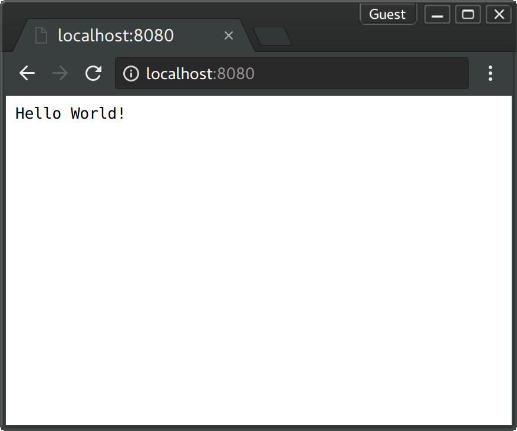

# Docker Tomcat Java Example

[![Software License][ico-license]](LICENSE.md)

This is a simple example for running a docker container with tomcat and java.

## Get it up and running

- [Install docker on your machine.][install-docker]

- [Install docker-compose on your machine.][install-docker-compose]

- [Install gradle on your machine.][install-gradle]

- Clone this repository.

``` bash
$ git clone https://github.com/mhilker/docker-tomcat-java-example
```

- Switch to the cloned directory.

``` bash
$ cd docker-tomcat-java-example
```

- Build the project.

``` bash
$ ./gradlew build
```

- Start the stack.

``` bash
$ docker-compose up
```

- You should see an output like this.

``` bash
docker-compose up --build
Building tomcat
Step 1/3 : FROM tomcat:alpine
 ---> 877ea9315a49
Step 2/3 : RUN rm -fr /usr/local/tomcat/webapps/ROOT
 ---> Using cache
 ---> eca02f5f3cd9
Step 3/3 : COPY ./build/libs/docker-tomcat-java-example.war /usr/local/tomcat/webapps/ROOT.war
 ---> Using cache
 ---> 00bf21347503
Successfully built 00bf21347503
Successfully tagged dockertomcatjavaexample_tomcat:latest
Starting dockertomcatjavaexample_tomcat_1
Attaching to dockertomcatjavaexample_tomcat_1
tomcat_1  | 17-Jun-2017 14:03:31.578 INFO [main] org.apache.catalina.startup.Catalina.start Server startup in 403 ms
```

- Visit `localhost:8888` in your browser. You should see an output like this.



## License

The MIT License (MIT). Please see [License File](LICENSE.md) for more information.

[ico-license]: https://img.shields.io/badge/license-MIT-brightgreen.svg?style=flat-square
[install-docker]: https://docs.docker.com/engine/installation
[install-docker-compose]: https://docs.docker.com/compose/install
[install-gradle]: https://gradle.org/install
